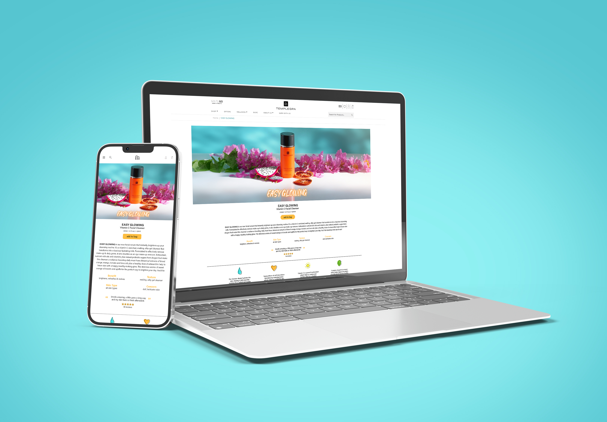
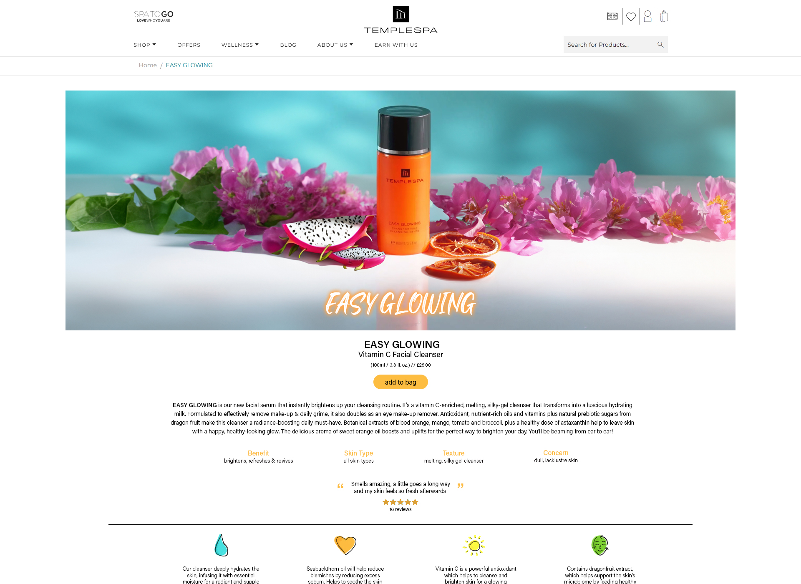
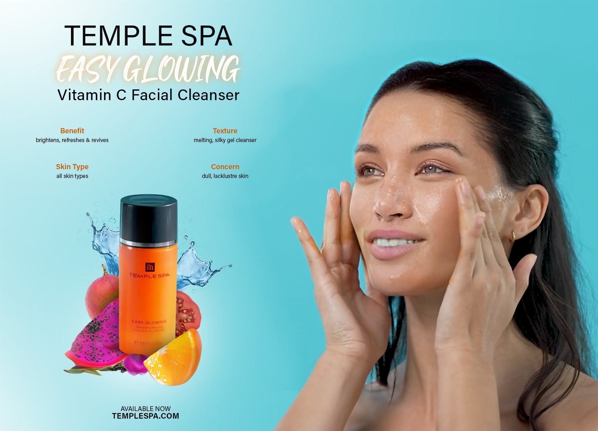

# Temple Spa Website Redesign for Vitamin C Cleanser Launch

## Project Overview
This project involves a comprehensive redesign for the **Temple Spa** brand, focusing on the launch of their new **Vitamin C Cleanser**. The brief called for a creative approach to designing and executing assets across multiple platforms, ensuring consistent branding and responsiveness across web and print. This project delivers a range of digital and physical assets to support the product launch, aligning with Temple Spa’s aesthetic and marketing objectives.

## Key Deliverables

### 1. **Conceptual Moodboard**
   - Developed a vibrant, nature-inspired moodboard to capture the essence of the new **Vitamin C Cleanser**. It showcases creative ideas for visuals, color schemes, typography, and execution plans for the digital landing page.

### 2. **Landing Page Redesign**
   - Redesigned the **Temple Spa** landing page, integrating a new hero image to highlight the product’s benefits. The landing page is fully responsive, ensuring optimal performance across all devices. Consistency was maintained between the desktop, tablet, and mobile versions, reinforcing the brand’s modern and clean aesthetic.

### 3. **Social Media Assets**
   - Created Instagram posts to promote the new cleanser, featuring custom designs and visuals aligned with the campaign’s branding. The assets are tailored to engage Temple Spa’s audience on social media platforms.

### 4. **Custom Icons**
   - Designed bespoke icons for the website to highlight product benefits and features in a visually appealing, intuitive manner.

### 5. **Poster Design**
   - Produced a promotional poster using the new assets and branding guidelines to create a cohesive offline representation of the product launch.

## Brief Requirements
The project fulfills the following aspects of the brief:
- **Website Creatives / Landing Pages / Hub:** Redesigned landing page with a responsive, engaging design.
- **Email Creatives:** Templates were conceptualized for email campaigns to support product promotion.
- **Social Media Asset Generation:** Developed Instagram posts tailored to the new product and brand tone.
- **Product Campaign Assets:** New hero image, posters, and social media images showcasing the cleanser.
- **PPC & Marketing Calendar Initiatives:** Conceptualized ad creatives aligned with the product's launch timeline.
- **Photography & Styling Input:** Contributed to the visual direction, ensuring all images reflected the product's key benefits.
- **Print Ads & Offline Collateral:** Created a poster that can be used for both promotional events and in-store displays.
- **Exhibition & Event Displays:** Proposed ideas for branding at physical events, ensuring cohesion between digital and offline brand representation.
- **Print Perfection:** All assets were optimized for print, ensuring high-quality output for any offline materials.

## Technologies & Tools
- **Design Software:** Adobe Illustrator, Photoshop
- **Web Development:** HTML, CSS, JavaScript
- **Responsive Framework:** Bootstrap for mobile-first design
- **Version Control:** GitHub

## Conclusion
This project showcases the creative execution across various mediums, ensuring Temple Spa’s new **Vitamin C Cleanser** has strong brand presence both online and offline. The assets developed reflect the product’s fresh, natural appeal, while maintaining the luxurious essence of the Temple Spa brand.

